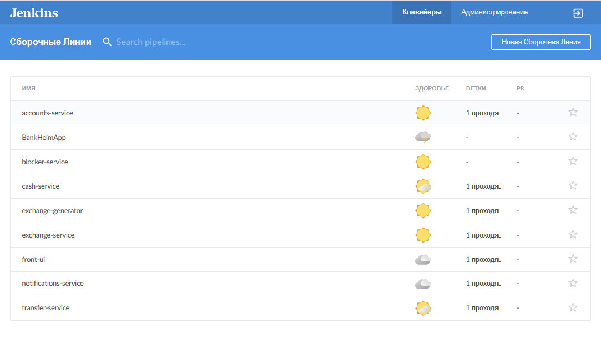
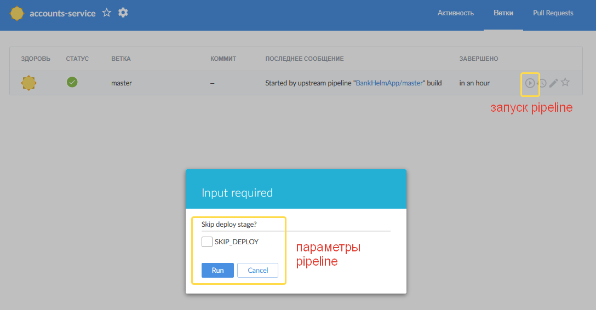
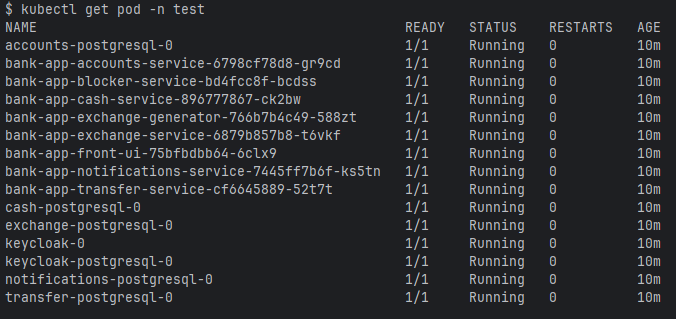

### Микросервисное приложение «Банк»

Микросервисное приложение «Банк» с использованием Spring Boot (реактивный стек) и паттернов микросервисной архитектуры,
с настроенным CI/CD (Jenkins), деплоем в k8s, с Apache Kafka для обмена сообщениями между микросервисами
в рамках выполнения задания спринта 11 курса Middle-Java Яндекс.Практикум.
- Spring Boot 3.4.4
- Spring Security
- Spring Cloud Contract
- R2DBC
- WebFlux
- Thymeleaf
- Lombok
- Jenkins
- K8s
- Apache Kafka
- Spring Kafka

Приложение состоит из следующих микросервисов, реализованных в виде отдельных моделей многомодульного проекта:
- [фронта (Front UI)](front-ui)
- [сервиса аккаунтов (Accounts)](accounts-service)
- [сервиса обналичивания денег (Cash)](cash-service)
- [сервиса перевода денег между счетами одного или двух аккаунтов (Transfer)](transfer-service)
- [сервиса конвертации валют (Exchange)](exchange-service)
- [сервиса генерации курсов валют (Exchange Generator)](exchange-generator)
- [сервиса блокировки подозрительных операций (Blocker)](blocker-service)
- [сервиса уведомлений (Notifications)](notifications-service)

Сервисы разворачиваются в кластере k8s c помощью helm чартов.
Для обнаружения сервисов в кластере, балансировки нагрузки и маршрутизации внешнего трафика используется Gateway 
API на базе NGINX Gateway Fabric - API Gateway, Load Balancing, Service Discovery.

**ВАЖНО! Для исключения конфликта портов с другими Ingress или Gateway API в кластере они должны быть предварительно отключены или удалены.**

Все микросервисы реализующие [REST API](openapi), имеют контракты.

Все микросервисы разворачиваются в собственном контейнере (поде) - паттерн Single Service per Host.

Также часть сервисов имеют собственную БД - паттерн Database per Service.

Для OAuth2 используется Keycloak.

Все микросервисы предоставляют ручку /actuator/health для проверки своего состояния и проб liveness и readiness - паттерн Health Check API.

Сервис нотификации имитирует отправку сообщений на электронную почту, распечатывая их в лог.

Отправка уведомлений в сервис нотификации микросервисами Accounts, Cash и Transfer осуществляется через Apache Kafka.
Передача курсов валют exchange-generator для обновления в exchange-service осуществляется через Apache Kafka.

Конфигурации хранятся в виде шаблонов configmap и загружаются при развертывании через helm или обновляются через kubectl apply - паттерн External Configuration.

#### Сборка приложения

Для сборки всех модулей приложения осуществляется в рамках процессов CI/CD, реализованных в Jenkins.
Для каждого микросервиса и всего зонтичного проекта реализованы пайплайны для валидации, сборки, тестирования, 
развёртывания в тестовой и продакшен-средах k8s с использованием Helm-чартов (Jenkinsfile).

Для публикации и хранения артефактов сборки используется Nexus Sonatype, разворачиваемый в контейнере рядом с Jenkins.

Для запуска Jenkins и Nexus Sonatype необходимо:
1. Переименовать файл [.env.example](jenkins/.env.example) в `.env`
2. Указать в нем актуальные значения для переменных: KUBECONFIG_PATH, GHCR_TOKEN, GITHUB_USERNAME, GITHUB_TOKEN, GITHUB_REPOSITORY и DOCKER_REGISTRY.
3. Выполнить команды:
```shell
cd jenkins
docker compose up -d --build
```
  
В Jenkins настроены Multibranch Pipeline отдельно для каждого сервиса и зонтичный Multibranch Pipeline для всего приложения:


Поскольку Jenkins разворачивается локально и нет возможности настроить веб-хуки для запуска по событиям в репозитории,
запуск осуществляется вручную из [интерфейса Blue Ocean](http://localhost:8080/blue/organizations/jenkins/pipelines)
или [дашборда Jenkins](http://localhost:8080/). После рестарта контейнера Jenkins первый запуск из интерфейса Blue Origin
может давать ошибку невозможности выполнить checkout в связи с использованием очистки перед сборкой.
В этом случае запуск нужно выполнить из дашборда Jenkins.

При запуске из дашборда Jenkins пайплайны сборок для отдельных микросервисов запускается с флагом пропуска стадий деплоя. 
Возможность явно указать флаг есть при запуске из дашборда Blue Ocean:


Для валидации, сборки, тестирования, развёртывания в тестовой и продакшен-средах k8s всего приложения использовать зонтичный
пайплайн BankHelmApp. 

После старта Jenkins будет доступен по ссылке http://localhost:8080/, Nexus Sonatype по ссылке http://localhost:8081/


Статус подов после деплоя можно проверить командой `kubectl get pod -n <namespace>`. 
Приложение готово к работе когда все поды имеют статус Running и Ready 1/1.


После развертывания сайт приложения будет доступен по адресу: `http://bankapp.test.local` для тестовой среды и `http://bankapp.prod.local` для продакшн.

Для этого необходимо добавить следующие записи в etc/hosts:
```shell
127.0.0.1 bankapp.test.local
127.0.0.1 bankapp.prod.local
```


#### Пользователи
При первоначальной загрузке приложения создаются тестовые пользователи
1. `test_user1` c паролем `test_user1_pass`;
2. `test_user2` c паролем `test_user2_pass`;
3. `test_user3` c паролем `test_user3_pass`.

